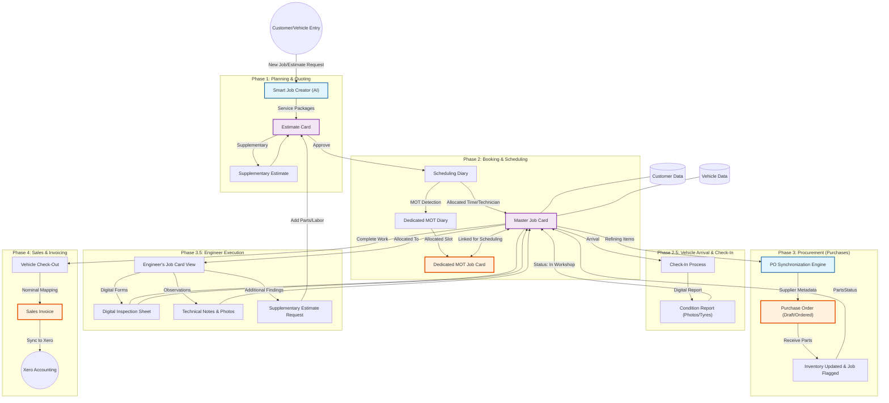

# Intelligent Scheduling: System Workflow Explainer

This document outlines how the Intelligent Scheduling system manages the lifecycle of a workshop job, from the initial contact to final accounting.

---

## Core Operational Cycles:

### 1. The Planning Cycle (AI & Estimates)
- **Input**: Plain-English job descriptions (e.g., *"MOT and Minor Service for Porsche REG123"*) are analyzed by the **Smart Job Creator**.
- **Service Packages**: The AI identifies appropriate parts, labor, and costs using predefined templates specific to that vehicle's lineage.
- **Iteration**: Any additional work discovered during the job is handled via **Supplementary Estimates**, keeping the main workflow unified.

### 2. The Scheduling Cycle (MOT Differentiation)
- **Bifurcated Allocation**: The system detects MOT requirements and splits the scheduling.
- **MOT Ramp Allocation**: A dedicated MOT job is created so the Mot ramp (which is a constrained resource) is accurately blocked out in the Diary, separate from general technician time.
- **Linked Records**: All secondary jobs are linked back to the master job card for unified status tracking.

### 2.5 The Arrival Cycle (Check-In & Condition Reports)
- **Digital Check-In**: When the vehicle arrives, the technician performs a digital check-in directly from the app.
- **Visual Diagnostics**: Photos of the vehicle and a dedicated **Tyre Condition Check** are captured to build a formal **Condition Report**.
- **State Transition**: The job status transitions from "Awaiting Arrival" $\rightarrow$ "In Workshop", letting the procurement and scheduling teams know the work is ready to begin.

### 3. The Procurement Cycle (POs & Parts)
- **Hardened PO Sync**: Our refined synchronization engine groups items from multiple estimates into a single set of Purchase Orders organized by supplier.
- **Race Condition Protection**: The sync uses a global lock to prevent duplicate orders and ensure sequential 944-prefix numbering remains unique across the entire user session.
- **Inventory Feedback**: Received parts trigger status updates direct to the Job Card (e.g., "Awaiting Order" $\rightarrow$ "Ready for Job").

### 3.5 The Execution Cycle (Engineer View & Management)
- **Engineer Portal**: Technicians access their own view of the **Job Card**, including all line items and previous history.
- **Digital Inspection**: The engineer completes an **Inspection Sheet** (Standard or MOT-specific) directly in the app, documenting any issues found.
- **Technical Observations**: Findings are captured as **Notes** or **Diagnostic Photos**, which are then linked to the vehicle's permanent history.
- **Dynamic Findings**: If new work is identified, the engineer can trigger a **Supplementary Estimate Request**, which automatically flows back into Phase 3 for part procurement and customer approval.

### 4. The Sales Cycle (Invoices & Xero)
- **Consolidated Billing**: All approved work from all estimate cards on a job is pulled into a single **Sales Invoice**.
- **Accounting Bridges**: Nominal codes and tax mapping allow for immediate export to **Xero**, closing the financial loop from purchases to final sales.
